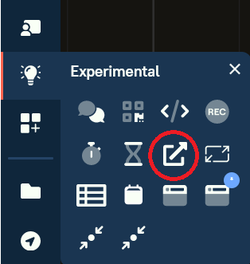

# Widget Template

A widget template for the Alleo ecosystem

## Installation

This project requires the following:
- NodeJS
- Git

### Setup + Build
- Clone this repository
- Run `npm install` in the base directory
- Run `npm run build-dev` or `npm run build-prod` to build the widget to the `dist/` folder

## Usage

To use the widget, host the contents of the `dist/` folder on a webserver, you'll need the link of the `manifest.json` file on this server.
- Open an Alleo board
- Open the Experimental tab in the sidebar
- Click External Widget, and paste the link of `manifest.json`

